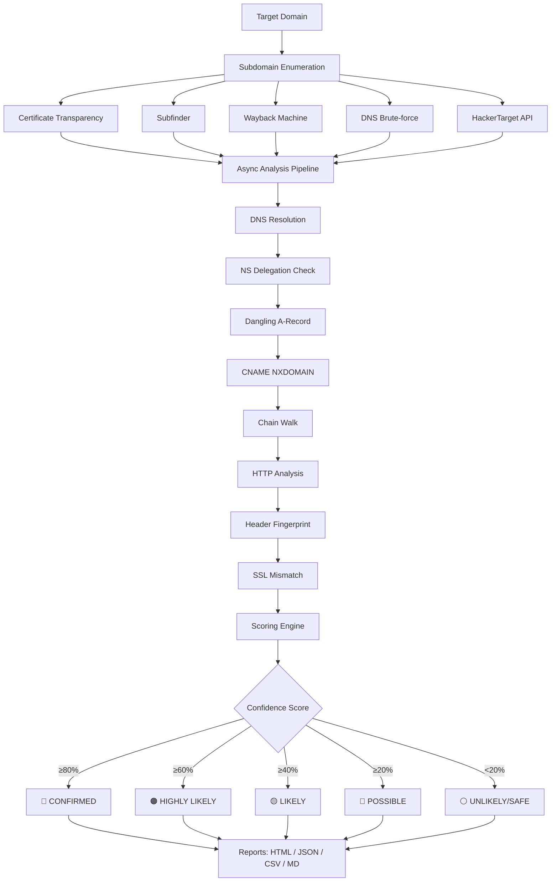

<p align="center">
  
  
  
  
</p>

<h1 align="center">🛡️ SubDomain Sentinel</h1>

<p align="center">
  <b>Enterprise-Grade Subdomain Takeover Scanner for Bug Bounty Hunters & Pentesters</b>
</p>

<p align="center">
  <i>Detect subdomain takeover vulnerabilities with 10-signal confidence scoring, 35+ provider fingerprints, NS delegation hijacking, CNAME chain walking, SSL mismatch detection, and zero false positives.</i>
</p>

---

## 🚀 Why SubDomain Sentinel?

Most subdomain takeover tools only check for dangling CNAMEs. **SubDomain Sentinel** goes far beyond that:

| Feature | Other Tools | SubDomain Sentinel |
|---------|:-----------:|:------------------:|
| CNAME → NXDOMAIN detection | ✅ | ✅ |
| NS delegation hijacking | ❌ | ✅ |
| Second-order CNAME chain walk | ❌ | ✅ |
| SSL certificate mismatch | ❌ | ✅ |
| HTTP header fingerprinting | ❌ | ✅ |
| Dangling A-record (cloud IP) | ❌ | ✅ |
| Wildcard DNS false positive suppression | ❌ | ✅ |
| `can_takeover` provider validation | ❌ | ✅ |
| Multi-signal confidence scoring | ❌ | ✅ (10 signals) |
| Concurrent async scanning | ⚠️ | ✅ (asyncio + Semaphore) |
| Interactive HTML report | ⚠️ | ✅ (dark-mode, no jQuery) |
| Subfinder integration | ❌ | ✅ |
| DNS brute-force | ⚠️ | ✅ |

---

## 🎯 Detection Vectors

```
┌──────────────────────────────────────────────────────────────┐
│                    10-STEP ANALYSIS PIPELINE                  │
├──────────────────────────────────────────────────────────────┤
│  1. DNS Resolution (CNAME, A records)                        │
│  2. NS Delegation Check → Dead nameservers? (+50 confidence) │
│  3. Dangling A-Record → Cloud IP + unreachable? (+15)        │
│  4. CNAME → NXDOMAIN Check (+40, strongest signal)           │
│  5. CNAME Chain Walk → Intermediate dangling? (+35/link)     │
│  6. HTTP Analysis → Status codes + error patterns (+20/+30)  │
│  7. Header Fingerprinting → Identify provider from headers   │
│  8. SSL Certificate Mismatch → CN ≠ subdomain (+15)          │
│  9. Dangling A behind CNAME → Cloud IP unreachable (+15)     │
│ 10. Multi-Signal Scoring → Weighted confidence 0-100%        │
├──────────────────────────────────────────────────────────────┤
│  Anti-FP: Wildcard suppression (-20), can_takeover cap (30)  │
└──────────────────────────────────────────────────────────────┘
```

### Confidence Scoring Breakdown

| Signal | Weight | Description |
|--------|--------|-------------|
| NS Delegation Takeover | **+50** | Nameservers return NXDOMAIN → full DNS control |
| CNAME NXDOMAIN | **+40** | CNAME target doesn't exist |
| CNAME Chain Dangling | **+35/link** | Intermediate CNAME returns NXDOMAIN (max +70) |
| Error Pattern Match | **+30** | Provider-specific error message in response |
| HTTP Status Code | **+20** | Expected error status code (404, 403, etc.) |
| SSL Mismatch | **+15** | Certificate CN/SAN doesn't match subdomain |
| Dangling A-Record | **+15** | IP in cloud range but host unreachable |
| Unclaimed Resource | **+10** | No claimed-site indicators found |
| No HTTP + NXDOMAIN | **+10** | No response at all with NXDOMAIN |
| Wildcard DNS | **−20** | False positive suppression |
| `can_takeover: False` | **cap 30** | Provider doesn't allow arbitrary claiming |

---

## 📦 Installation

### Prerequisites
- Python 3.7+
- pip

### Quick Install

```bash
# Clone the repository
git clone https://github.com/vimalpaul/SubDomain-Sentinel.git
cd subdomain-sentinel

# Install dependencies
pip3 install -r requirements.txt

# Run it
python3 subsentinal.py --help
```

### Dependencies

```bash
pip3 install httpx aiohttp dnspython tldextract colorama rich
```

### Optional: Install Subfinder (recommended)

```bash
# Go install
go install -v github.com/projectdiscovery/subfinder/v2/cmd/subfinder@latest

# Or via apt on Kali
sudo apt install subfinder
```

---

## 🔧 Usage

### Basic Scan

```bash
# Scan a domain with HTML report
python3 subsentinal.py example.com --html

# Scan with all report formats
python3 subsentinal.py example.com --html --json --csv --markdown
```

### Advanced Scanning

```bash
# Full scan with Subfinder + Brute-force + 100 threads
python3 subsentinal.py example.com --subfinder --bruteforce --threads 100 --html

# Scan from a list of known subdomains
python3 subsentinal.py example.com --subdomains-file subs.txt --html --json

# Scan a single subdomain (quick check)
python3 subsentinal.py example.com --single-subdomain staging.example.com --debug

# Aggressive scan with custom timeout
python3 subsentinal.py example.com --subfinder --bruteforce --threads 200 --timeout 15 --html
```

### Filtering & Output Control

```bash
# Only show HIGH and CRITICAL findings
python3 subsentinal.py example.com --severity-filter HIGH --html

# Quiet mode (no banner, minimal output)
python3 subsentinal.py example.com --quiet --html

# No colors (for CI/CD pipelines or piping)
python3 subsentinal.py example.com --no-color --quiet

# Custom output filename
python3 subsentinal.py example.com -o my_report --html --json
```

### Bug Bounty Workflow

```bash
# Step 1: Enumerate with subfinder + built-in sources + brute-force
python3 subsentinal.py target.com --subfinder --bruteforce --threads 100 --html --json -o target_scan

# Step 2: Check specific subdomains from recon
python3 subsentinal.py target.com --subdomains-file recon_subs.txt --html -o deep_scan

# Step 3: Quick check a suspicious subdomain
python3 subsentinal.py target.com --single-subdomain suspicious.target.com --debug
```

---

## 📋 All CLI Options

```
usage: subsentinal.py [-h] [--single-subdomain SINGLE_SUBDOMAIN]
                      [--subdomains-file SUBDOMAINS_FILE]
                      [--subfinder] [--subfinder-only]
                      [--subfinder-bin SUBFINDER_BIN]
                      [--subfinder-args SUBFINDER_ARGS]
                      [--bruteforce] [--wordlist-file WORDLIST_FILE]
                      [-o OUTPUT] [--html] [--json] [--csv] [--markdown]
                      [--no-reports]
                      [-t THREADS] [--rate-limit RATE_LIMIT] [--timeout TIMEOUT]
                      [--severity-filter {CRITICAL,HIGH,MEDIUM,LOW,INFO}]
                      [--debug] [--quiet] [--no-color] [--version]
                      [domain]
```

| Flag | Description | Default |
|------|-------------|---------|
| `domain` | Target domain to scan | — |
| `--single-subdomain` | Scan a single subdomain | — |
| `--subdomains-file` | File with list of subdomains | — |
| `--subfinder` | Use Subfinder for enumeration | off |
| `--subfinder-only` | Only use Subfinder (skip built-in) | off |
| `--bruteforce` | Enable DNS brute-force | off |
| `--wordlist-file` | Custom wordlist for brute-force | built-in |
| `-o, --output` | Base name for output files | auto |
| `--html` | Generate HTML report | off |
| `--json` | Generate JSON report | off |
| `--csv` | Generate CSV report | off |
| `--markdown` | Generate Markdown report | off |
| `--no-reports` | Don't generate any reports | off |
| `-t, --threads` | Concurrent threads | 50 |
| `--rate-limit` | Requests per second | 10 |
| `--timeout` | HTTP timeout (seconds) | 10 |
| `--severity-filter` | Min severity to display | all |
| `--debug` | Enable debug output | off |
| `--quiet` | Suppress non-essential output | off |
| `--no-color` | Disable colored output | off |

---

## 🏢 Supported Providers (35+)

<details>
<summary>Click to expand full provider list</summary>

| Provider | CNAME Pattern | Risk | Can Takeover |
|----------|--------------|------|:------------:|
| GitHub Pages | `.github.io` | HIGH | ✅ |
| AWS S3 | `.s3.amazonaws.com` | CRITICAL | ✅ |
| AWS CloudFront | `.cloudfront.net` | CRITICAL | ✅ |
| Heroku | `.herokuapp.com` | HIGH | ✅ |
| Vercel | `.vercel.app`, `.now.sh` | HIGH | ✅ |
| Netlify | `.netlify.app` | HIGH | ✅ |
| Firebase | `.web.app`, `.firebaseapp.com` | HIGH | ✅ |
| Azure | `.azurewebsites.net`, `.blob.core.windows.net` | HIGH | ✅ |
| Cloudflare | `.workers.dev`, `.pages.dev` | MEDIUM | ❌ |
| Fastly | `.fastly.net` | MEDIUM | ✅ |
| Shopify | `.myshopify.com` | HIGH | ✅ |
| Tumblr | `.tumblr.com` | HIGH | ✅ |
| WordPress | `.wordpress.com` | HIGH | ✅ |
| Pantheon | `.pantheonsite.io` | HIGH | ✅ |
| Surge | `.surge.sh` | MEDIUM | ✅ |
| Bitbucket | `.bitbucket.io` | HIGH | ✅ |
| GitLab | `.gitlab.io` | HIGH | ✅ |
| Fly.io | `.fly.dev` | MEDIUM | ✅ |
| Render | `.onrender.com` | MEDIUM | ✅ |
| Cargo | `.cargo.site` | MEDIUM | ✅ |
| Ghost | `.ghost.io` | HIGH | ✅ |
| Desk | `.desk.com` | MEDIUM | ✅ |
| Zendesk | `.zendesk.com` | HIGH | ✅ |
| Unbounce | `.unbouncepages.com` | MEDIUM | ✅ |
| Tilda | `.tilda.ws` | MEDIUM | ✅ |
| HelpScout | `.helpscoutdocs.com` | MEDIUM | ✅ |
| Intercom | `.custom.intercom.help` | MEDIUM | ✅ |
| ReadMe | `.readme.io` | MEDIUM | ✅ |
| Strikingly | `.strikinglydns.com` | MEDIUM | ✅ |
| FeedPress | `.redirect.feedpress.me` | MEDIUM | ✅ |
| Teamwork | `.teamwork.com` | MEDIUM | ✅ |
| AgileCRM | `.agilecrm.com` | MEDIUM | ✅ |
| UptimeRobot | `.uptimerobot.com` | LOW | ✅ |
| LaunchRock | `.launchrock.com` | MEDIUM | ✅ |
| SmartJobBoard | `.smartjobboard.com` | MEDIUM | ✅ |

</details>

---

## 📊 Report Formats

### Interactive HTML Report
- 🌙 Dark-mode themed design
- 🔍 Real-time search and filter
- 📊 Sort by confidence, status, or risk
- 📈 Confidence bar visualization
- 🎨 Color-coded evidence (NXDOMAIN = red, Wildcard = amber)
- 💡 Click-to-expand details panel
- 🚫 Zero CDN dependencies (no jQuery)

### JSON Report
Machine-readable output with full finding details, including all evidence and verification steps.

### CSV Report
Spreadsheet-compatible output for bulk analysis and reporting.

### Markdown Report
Clean markdown tables for documentation and ticket creation.

---

## 🔍 How It Works



---

## 🛡️ Anti-False-Positive Mechanisms

1. **Wildcard DNS Detection** — Automatically detects wildcard DNS and reduces confidence by 20 points
2. **`can_takeover` Validation** — Providers like Cloudflare that don't allow arbitrary domain claiming are capped at 30% confidence
3. **Claimed Site Detection** — If the response contains the provider's branding, confidence is reduced by 15 points
4. **Multi-Signal Requirement** — A single signal alone can't reach "CONFIRMED" status; multiple corroborating signals are required

---

## 📝 Example Output

```
[INFO] Starting scan for: example.com
[INFO] Found 47 subdomains from 4 sources

🔍 TAKEOVER FINDINGS:
  💀 Confirmed: 1
  🚨 Highly Likely: 2
  🔥 Likely: 3
  ⚠️ Possible: 5
  ✅ Safe: 36

🚨 CRITICAL FINDINGS:
  • staging.example.com
    Provider: heroku
    CNAME: ancient-river-1234.herokuapp.com
    Status: CONFIRMED
    Confidence: 90%
    Evidence:
      🔴 NXDOMAIN: CNAME target does not exist
      Provider error message found: 'No such app'
      Expected HTTP status (404) found
      No claimed site indicators found
    Next Steps: Navigate to https://dashboard.heroku.com
```

---

## ⚠️ Legal Disclaimer

**This tool is intended for authorized security testing only.** Always ensure you have proper authorization before scanning any domain. Unauthorized scanning may violate computer crime laws in your jurisdiction.

- ✅ Use on domains you own
- ✅ Use on bug bounty programs (within scope)
- ✅ Use with written authorization from the domain owner
- ❌ Never use on domains without permission

---

## 🤝 Contributing

Contributions are welcome! Here's how you can help:

1. **Fork** the repository
2. **Create** a feature branch (`git checkout -b feature/amazing-feature`)
3. **Commit** your changes (`git commit -m 'Add amazing feature'`)
4. **Push** to the branch (`git push origin feature/amazing-feature`)
5. **Open** a Pull Request

### Ideas for Contribution
- Add more provider fingerprints
- Improve SSL mismatch detection
- Add WHOIS expiry checking
- Add Slack/Discord webhook notifications
- CI/CD integration examples

---

## 📜 License

This project is licensed under the MIT License - see the [LICENSE](LICENSE) file for details.

---

## ⭐ Star History

If this tool helped you find a vulnerability, please give it a ⭐!

---

<p align="center">
  <b>Built with ❤️ for the Bug Bounty Community</b>
</p>
